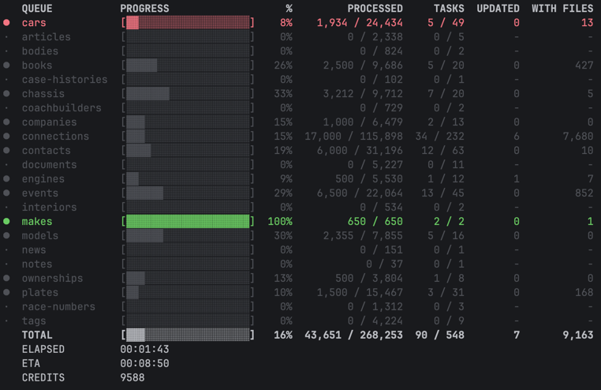

# Concurrent Console Progress



[](https://packagist.org/packages/uncrackable404/concurrent-console-progress)
[](https://packagist.org/packages/uncrackable404/concurrent-console-progress)
[](https://packagist.org/packages/uncrackable404/concurrent-console-progress)

## Introduction

**Concurrent Console Progress** is a dashboard for monitoring concurrent progress in PHP console applications. Ideal for resource-intensive tasks (imports, API calls) distributed across multiple simultaneous queues.

Inspired by [**laravel/prompts**](https://github.com/laravel/prompts) and powered by [**spatie/fork**](https://github.com/spatie/fork).

## Installation

You can install the package via composer:

```bash
composer require uncrackable404/concurrent-console-progress
```

## Usage

The package provides a `ConcurrentProgress` class and a `concurrent()` helper.

### Minimal Example

A simple usage with a single queue.

```php
use function Uncrackable404\ConcurrentConsoleProgress\concurrent;

$tasks = [
    ['queue' => 'main', 'steps' => 1, 'id' => 1],
    ['queue' => 'main', 'steps' => 1, 'id' => 2],
    // ...
];

$results = concurrent(
    queues: ['main' => ['label' => 'Processing']],
    tasks: $tasks,
    concurrent: 10,
    process: function ($task) {
        // Your logic here
        usleep(100000);
        return ['advance' => 1];
    }
);
```

### Complete Example

Multiple queues, custom columns, and footer information. This is ideal for complex imports where you want to monitor different entities at once.

```php
use Uncrackable404\ConcurrentConsoleProgress\ConcurrentProgress;

$queues = [
    'users' => ['label' => 'Importing Users'],
    'orders' => ['label' => 'Importing Orders'],
];

$tasks = [
    ['queue' => 'users', 'steps' => 1, 'data' => ['id' => 1, 'name' => 'John']],
    ['queue' => 'orders', 'steps' => 1, 'data' => ['id' => 101, 'total' => 50]],
    // ... more tasks
];

$progress = new ConcurrentProgress();
$results = $progress->run(
    queues: $queues,
    tasks: $tasks,
    concurrent: 5,
    columns: [
        ['key' => 'label', 'label' => 'ENTITY'],
        ['key' => 'progress', 'label' => 'STATUS'],
        ['key' => 'id', 'label' => 'ID'],
        ['key' => 'status', 'label' => 'LAST ITEM'],
    ],
    footer: [
        ['label' => 'Memory Peak', 'value' => '{memory_peak}'],
        ['label' => 'Time', 'value' => '{elapsed}'],
    ],
    process: function ($task) {
        // Complex logic (e.g. API call to Podio)
        $id = $task['data']['id'] ?? 'unknown';
        
        // Return metadata to be displayed in the dashboard
        return [
            'advance' => 1,
            'meta' => [
                'id' => $id,
                'status' => "✅ Processed",
            ],
            'global' => [
                'memory_peak' => memory_get_peak_usage(true),
            ],
        ];
    }
);
```

## Laravel Integration

The package comes with a `ConsoleProgressServiceProvider` that automatically configures the output for Laravel commands.

If you are using Laravel, the `ConcurrentProgress` class will automatically detect the console output. The `concurrent()` helper is also available for a more concise syntax.

```php
// In a Laravel Command
$results = concurrent(
    queues: ['import' => ['label' => 'Importing Data']],
    tasks: $tasks,
    concurrent: 8,
    process: fn($task) => doSomething($task)
);
```

## Synchronous Mode

Set `concurrent: 0` to run all tasks in the same process, without forking. This is useful for debugging with `dd()`, `dump()`, or `xdebug`.

```php
$results = concurrent(
    queues: ['main' => ['label' => 'Processing']],
    tasks: $tasks,
    concurrent: 0,
    process: function ($task) {
        dd($task); // works — same process, no fork
        return ['advance' => 1];
    }
);
```

The synchronous mode reuses the same rendering, progress tracking, and fail-fast logic as the forked path. The only difference is that tasks run sequentially in the parent process.

| `concurrent` | Behavior |
|---|---|
| `0` | Synchronous — no fork, same process |
| `1` | Forked — one child process at a time |
| `N` | Forked — up to N child processes in parallel |

## How it works

This package acts as a bridge between the [**spatie/fork**](https://github.com/spatie/fork) engine and a responsive console UI.

- **Process Isolation**: It uses `pcntl_fork` to run each task in its own isolated child process. This means a crash in one task won't affect others, and memory leaks are avoided since each process exits after completion.
- **Real-time Monitoring**: As tasks complete and send their results back to the parent process, the dashboard updates the table in real-time, providing feedback on progress, ETA, and custom metadata.
- **Fail-fast**: If a critical error occurs or if you interrupt the process (Ctrl+C), it gracefully shuts down child processes.
- **Synchronous Mode**: When `concurrent` is set to `0`, tasks run sequentially in the parent process, bypassing `spatie/fork` entirely while preserving the same UI and error handling.

## License

The MIT License (MIT).
